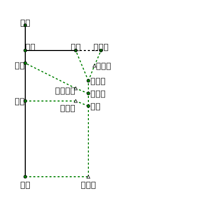

# 郡大西巒(YYYY-MM-DD) #

## 待辦事項

- MM/DD(W)
    - [ ] 留守
    - [ ] 保險
    - [X] 確認路況
    - [ ] 充電(電池/營燈)

- MM/DD(W)
    - [ ] 糧食/炊具
    - [X] 火車票
    - [ ] 打包完成(手電筒/營燈/拖鞋/盥洗用品)

- MM/DD(W)
    - [ ] 剪指甲

## 天氣預報 ##

- 日出日落 [0625~1754](https://sunrise.maplogs.com/zh-TW/taiwan.777.html)
- 中央氣象局 [佳暮](http://www.cwb.gov.tw/V7/forecast/entertainment/tribes/014_1001327A04.htm) | [知本](http://www.cwb.gov.tw/m/f/entertainment/E040.php)

## 文件 ##

- 入山證(含名冊)
- 入園證
- 保護區/保留區
- 登山險

## 地圖 ##
- [參考航跡](https://www.dropbox.com/s/0m7ha4hrnhcnnez/ref.gpx?dl=1)
- [Overview](https://www.dropbox.com/s/0m7ha4hrnhcnnez/ref.gpx?dl=1)
- [魯地圖] [D1](https://www.dropbox.com/s/xzuz2yz4igvfwj1/d1.png?dl=1) | [D2](https://www.dropbox.com/s/q1t328v0u3hr44z/d3.png?dl=1)

{map:trekkr}

## 預計行程 ##

- [🌤][東埔] D00 台北->東埔
- [🌤][東埔] D01 `0600`東埔*1100*->`0700`愛玉亭*1260*->`1600`紮營*2600*
- [🌤][郡大] D02 `0600`C1*2600*->`1000~1100`南鞍營地(午餐)*3200*->`1130`郡大山*3292*->`1430`望鄉山*3007*->`1500`郡大林道登山口*2850*->`1600`郡大林道紮*2850*
- [🌤][西巒] D03 `0530`C2*2850*->`0630`清水登山口*2700*->`1000~1030`清水山南峰(午餐)*3025*->`1100`清水山*3048*->`1130`林道*2800*->`1400`金子叉*2630*->`1730`巒安堂*2620*
- [🌤][雙龍] D04 `0500`C3*2620*->`0600`西巒大山*3081*->`0700`巒安堂*2620*->`1000`停機坪*2280*->`1500`雙龍林道*1600*->`1800`雙龍吊橋*680*->`1830`雙龍派出所*600*

| 水 | D1 | D2 | D3 | D4 |
| -- | -- | -- | -- | -- |
| 午 |    | v  | v  |  v |
| 晚 |    | v  | v  |  v |

[東埔]: https://www.cwb.gov.tw/V8/C/L/Tribes/Tribes.html?PID=004-1000812A04
[郡大]: https://www.cwb.gov.tw/V8/C/L/Mountain/Mountain.html?PID=D039
[西巒]: https://www.cwb.gov.tw/V8/C/L/Mountain/Mountain.html?PID=D046
[雙龍]: https://www.cwb.gov.tw/V8/C/L/Mountain/Mountain.html?PID=D046

### 注意事項 ###

- D2 郡大南鞍前崩壁，約H2800

### 入山證 ###

## 實際行程 ## 

- {晴} D00 台北->東埔
- {雨} D01 `0600`東埔*1100*->`0700`愛玉亭*1260*->`1600`紮營*2600*
- {霧} D02 `0600`C1*2600*->`1000~1100`南鞍營地(午餐)*3200*->`1130`郡大山*3292*->`1430`望鄉山*3007*->`1500`郡大林道登山口*2850*->`1600`郡大林道紮*2850*
- {風} D03 `0530`C2*2850*->`0630`清水登山口*2700*->`1000~1030`清水山南峰(午餐)*3025*->`1100`清水山*3048*->`1130`林道*2800*->`1400`金子叉*2630*->`1730`巒安堂*2620*
- {陰} D04 `0500`C3*2620*->`0600`西巒大山*3081*->`0700`巒安堂*2620*->`1000`停機坪*2280*->`1500`雙龍林道*1600*->`1800`雙龍吊橋*680*->`1830`雙龍派出所*600*
- {變} D04 `0500`C3*2620*->`0600`西巒大山*3081*->`0700`巒安堂*2620*->`1000`停機坪*2280*->`1500`雙龍林道*1600*->`1800`雙龍吊橋*680*->`1830`雙龍派出所*600*

## 行程記錄 ##

### D1 四季－霧覧山登山口 (陰/霧雨)

    0730 宜蘭轉運站
    0901 四季國小
    1014~39 四季林道柵欄。沒有休息，一口氣衝到柵欄。
    1154~1236 嘉平林道叉。又是一口氣衝到，簡單午餐。碰到原住民上來巡水管。
    1433~1507 林字瀑布前獵寮。休息取水。兩人身上共背了13升水。(公水10升)
         其實有點太早背了，後面還有穩定水源。
    1516 溪溝，水穩定。
    1518 溪溝，水穩定。
    1532 見晴山登山口。之後芒草漸多。
    1632 霧覽山登山口。鞍部有營地大小約4Tx2，但不避風雨，且地上泥濘。略退回一點，在林道上整地紮營。
         往比亞毫之路，掩蓋在芒草叢之中。

* 公水10升 - 用3.5升 = 剩6.5升

### D2 霧覽山登山口-西霧覽營地 (陰/雨)

    0730 出發。甫出發就下著霧雨。
         路徑單純，但箭竹頗密。
    0925 空地。
    1029~1121 三叉營地。午餐。
         繞過山頭後，出現開闊的森林，但似乎不見明顯的營地。
         有指標和路條往霧覽山，但覺得行程不如預計，於是不去。
         午餐後循稜而行，路條漸少，大部分是柯藝橘布條。
    1233 西霧覽前鞍。
    1341 西霧覽前2521峰。
    1346 小鞍。可見前方斷稜，應為記錄所提軍艦岩。
         由左方碎石坡繞過，碎石皆是比拳頭大石塊，加上天雨，極易滑動。盡可能沿著樹而行。
         見上方缺口，爬回稜線。
    1415 回稜線。
         循稜而行，左邊盡是崩塌。
    1448 三米高落差。
         由左方碎石坡向上爬，這處碎石較細，好爬很多。
         繞回稜線，續行。左下方有一凹陷平地，地形上是雙股稜，可能就是世新提到的"溪溝"。
    1535 西霧覽山。轉稜處，沒有路牌，一下就掠過了。
    1543 路中有圖根點，但比較像界樁塑膠釘。
    1608 西霧覽營地。稜右下方有零星幾塊松針營地。
         其中一塊有一些垃圾，且有一約10升水桶，應該就是記錄寫的備用水，水算清澈，但有浮游生物，不取。
         (水桶已經劣化，不能當穩定水源)

## 後記 ##

- 上切處應處意
- 下切林道應注意

### 資源銷耗 ###

- **GPS電池** NN顆
- **瓦斯** 570g ~= 2.5罐
- **衛生紙** <半包

### 留守紀錄 ###

## 行程資訊 ##

### 營地|水源 ###

- O|X 松針營地 無水源

### 訊號 ###

(2019/11 中華電信4G) 起登位於東部時，手機訊號較少且弱；但越往西走，受惠於玉山北峰基地台的建置，南三段手機訊號滿多的；整理如下：

    - 瑞穗林道33.9K可通(微弱)
    - 沙武巒越稜點附近可通(微弱)
    - 盧利拉駱山三角點及往前約0.1K處可通(微弱)
    - 丹大山三角點陰天及晴天測試約半小時(均無訊號)

## 交通 ##

### 去程 ###

東埔停車場車泊

### 回程 ###

- {豐榮6288(水里-雙龍)} 地利-苗圃 $27, 20min

    - 雙龍[發] 0640 0800 1030 1230 1500 1720

- {台灣好行6732(東埔-水里)} {台灣好行6734(東埔-集集)} 苗圃-東埔 $118, 50min
豐丘-東埔 30min

    - 6732水里[發] 0600 0800 0900 1300 **1430** 1740 **2000** (**周五停駛**)
    - 6734水里[發] 1110 1610

## 住宿 ##

- D0 東埔東埔停車場
- D4 雙龍??
- D5 東埔山莊溫泉

## 行程參考 ##

  - 2015.04 [自組隊．南湖北稜][1]
  - 2005.07 [北大．高嚮 南湖北稜紀錄][8] | [blog][9]

[1]: https://www.ptt.cc/bbs/Hiking/M.1428809971.A.494.html
[8]: http://www.mountainpig.com/travel_single.php?id=2178&PB_page=110
[9]: http://beavermax.pixnet.net/blog/post/1077251
